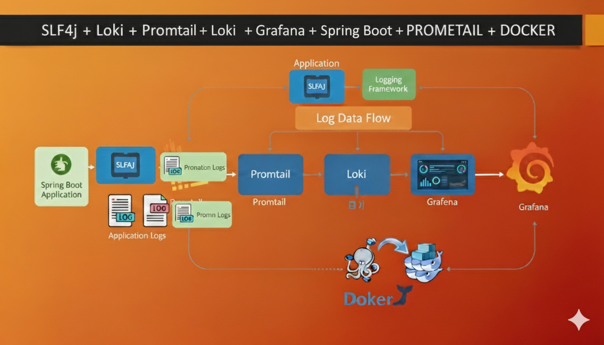

# Smart Delivery Management System (SDMS)

Application de gestion logistique pour SmartLogi - Système complet de gestion de livraison de colis.

## Technologies

# Architecture de Logging et de Développement Backend

Ce projet décrit une architecture de logging robuste et scalable, ainsi que les outils clés utilisés pour le développement de l'application backend Spring Boot.

## Technologies Clés

Voici un aperçu des principaux composants de cette architecture de logging et de développement :

         

---
## Presentation Du interction project 

## Fonctionnalités

### Gestion des Entités
- **ClientExpediteur** - Gestion des clients expéditeurs
- **Destinataire** - Gestion des destinataires
- **Livreur** - Gestion des livreurs
- **Zone** - Gestion des zones de livraison
- **Colis** - Gestion des colis avec statuts et priorités
- **Produit** - Gestion des produits
- **HistoriqueLivraison** - Traçabilité complète des colis

### API REST
- CRUD complet pour toutes les entités
- Pagination et tri
- Recherche par mots-clés
- Filtrage par statut, priorité, zone, ville
- Statistiques par livreur et zone

## Installation

1. **Cloner le projet**
   \`\`\`bash
   git clone <repository-url>
   cd smart-spring
   \`\`\`

2. **Configurer la base de données**
   Créer une base de données MySQL:
   \`\`\`sql
   CREATE DATABASE smartSpring CHARACTER SET utf8mb4 COLLATE utf8mb4_unicode_ci;
   \`\`\`

3. **Configurer application.yml**
   Modifier les paramètres de connexion dans `src/main/resources/application.yml`

4. **Compiler le projet**
   \`\`\`bash
   mvn clean install
   \`\`\`

5. **Lancer l'application**
   \`\`\`bash
   mvn spring-boot:run
   \`\`\`

L'application sera accessible sur `http://localhost:8080`

## Liquibase

Les migrations de base de données sont gérées automatiquement par Liquibase au démarrage de l'application.

### Commandes Maven Liquibase

\`\`\`bash
# Mettre à jour la base de données
mvn liquibase:update

# Générer un diff
mvn liquibase:diff

# Rollback
mvn liquibase:rollback
\`\`\`

## Endpoints API

### Clients Expéditeurs
- `POST /api/clients-expediteurs` - Créer un client
- `GET /api/clients-expediteurs` - Liste paginée
- `GET /api/clients-expediteurs/{id}` - Détails
- `PUT /api/clients-expediteurs/{id}` - Modifier
- `DELETE /api/clients-expediteurs/{id}` - Supprimer
- `GET /api/clients-expediteurs/search?keyword=` - Rechercher

### Colis
- `POST /api/colis` - Créer un colis
- `GET /api/colis` - Liste paginée
- `GET /api/colis/{id}` - Détails
- `PUT /api/colis/{id}` - Modifier
- `DELETE /api/colis/{id}` - Supprimer
- `GET /api/colis/statut/{statut}` - Filtrer par statut
- `GET /api/colis/priorite/{priorite}` - Filtrer par priorité
- `GET /api/colis/livreur/{livreurId}` - Colis d'un livreur
- `GET /api/colis/livreur/{livreurId}/stats` - Statistiques livreur
- `GET /api/colis/zone/{zoneId}/stats` - Statistiques zone

## Validation

Toutes les DTOs utilisent les annotations de validation Jakarta:
- `@NotBlank` - Champs obligatoires
- `@Email` - Validation email
- `@Size` - Taille min/max
- `@DecimalMin` - Valeur minimale
- `@Min` - Valeur minimale entière

## Logs

L'application utilise SLF4J avec Logback pour les logs:
- **DEBUG** - Opérations de lecture
- **INFO** - Opérations de création/modification/suppression
- **ERROR** - Erreurs

## Auteur

SmartLogi Development Team

# La partie Du Logging 

--> Installation du Loki localement :  https://github.com/grafana/loki/releases

--> : Installer Promtail (pour lire ton fichier log et l’envoyer à Loki)
    